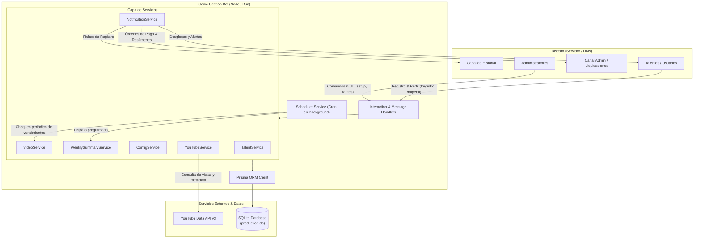

# 🦔 Sonic Gestión Bot

[](tests/)
[](https://bun.sh/)
[](https://discord.js.org/)
[](https://www.prisma.io/)
[](https://www.sqlite.org/)
[](DEPLOY.md)

**Sonic Gestión Bot** es una solución integral y modular para comunidades y equipos de producción audiovisual en Discord. Automatiza el alta de talentos (actores y editores), el seguimiento de videos de YouTube, el cálculo de honorarios y bonos por metas de visualizaciones a plazo fijo, la emisión de órdenes de liquidación con enlaces de pago de un solo clic (PayPal / Binance Pay) y resúmenes semanales consolidados.

---

## 📑 Tabla de Contenidos

1. [Características Principales](#-características-principales)
2. [Arquitectura del Sistema](#-arquitectura-del-sistema)
3. [Requisitos Previos](#-requisitos-previos)
4. [Instalación y Configuración](#-instalación-y-configuración)
   - [Configuración del Entorno (.env)](#configuración-del-entorno-env)
   - [Base de Datos con Prisma](#base-de-datos-con-prisma)
5. [Ejecución](#-ejecución)
6. [Flujo de Trabajo Operativo](#-flujo-de-trabajo-operativo)
7. [Guía de Comandos](#-guía-de-comandos)
   - [👑 Configuración y Administración](#-configuración-y-administración-solo-administradores)
   - [🎭 Gestión de Talentos](#-gestión-de-talentos)
   - [🎬 Registro y Gestión de Videos](#-registro-y-gestión-de-videos)
   - [ℹ️ Información General](#ℹ️-información-general)
8. [Despliegue con Docker](#-despliegue-con-docker)
9. [Pruebas Automatizadas](#-pruebas-automatizadas)
10. [Estructura del Proyecto](#-estructura-del-proyecto)

---

## ✨ Características Principales

- 🧙‍♂️ **Asistente Interactivo de Configuración (`!setup`)**: Wizard guiado por pasos (botones, menús selectores y modales) para configurar prefijo, canales de Discord, canal oficial de YouTube, tarifas base, bonos escalonados y plazos de espera sin reiniciar el bot.
- ⚡ **Registro Interactivo de Videos (`!registrar-video`)**:
  - Detección automática del canal oficial de YouTube vinculado (`!set-canal`) listando los últimos **25 videos recientes** en menú desplegable.
  - Asignación de participantes mediante selectores filtrados **estrictamente a talentos registrados en base de datos**.
  - Detección inteligente de roles por texto o UI (reconoce quién es editor y quiénes son actores automáticamente).
  - Publicación instantánea de ficha informativa en el canal de historial y notificación automática por mensaje directo (DM) a cada talento involucrado.
- 💰 **Cálculo Dinámico de Tarifas y Bonificaciones**:
  - Tarifas base individuales para actores y editores.
  - Umbrales de vistas configurables (por defecto: Umbral 1 a 500k vistas y Umbral 2 a 1M vistas) con bonificaciones acumulables.
  - Moneda parametrizable (MXN, USD, EUR, etc.).
- 🚀 **Checkout Rápido & Órdenes de Liquidación**:
  - Generación de órdenes de pago con bloques monospacio listos para copiar.
  - Enlaces de un clic con montos prellenados para **PayPal.me** (`paypal.me/usuario/montoMXN`) y **Binance Pay ID / Payment Links**.
  - Flujo de estados atómico: `PENDING` ➔ `CALCULATED` ➔ `PAID`.
  - Notificaciones privadas (DM) a cada talento con su desglose detallado.
- 📊 **Resumen Semanal Automatizado (`!resumen-semanal`)**:
  - Emisión periódica programada (día y hora configurables) en canal administrativo con mención a `@everyone` y/o envío privado por MD.
  - Paginación interactiva (botones Anterior / Siguiente) con desglose por video y total consolidado semanal.
  - Pre-liquidación automática en el mismo día para videos pendientes que vencen en la fecha del corte.
- 🛡️ **Tolerancia y Resiliencia Empresarial**:
  - Protección contra concurrencia y cálculos duplicados (idempotencia).
  - Manejo seguro de cuotas o caídas de la API de YouTube y fallos por DMs bloqueados en Discord.
  - Módulos desacoplados mediante Services y Handlers especializados.

---

## 🏛 Arquitectura del Sistema



---

## 📋 Requisitos Previos

- **Runtime:** [Bun](https://bun.sh/) (v1.1.0 o superior recomendado) o [Node.js](https://nodejs.org/) (v18.0.0 o superior).
- **Discord Bot:** Aplicación creada en [Discord Developer Portal](https://discord.com/developers/applications) con **Privileged Gateway Intents** activados:
  - `Server Members Intent` (Guild Members)
  - `Message Content Intent`
- **Google Cloud Platform:** [YouTube Data API v3](https://console.cloud.google.com/) habilitada con su respectiva API Key.

---

## ⚙️ Instalación y Configuración

### 1. Clonar el Repositorio
```bash
git clone https://github.com/tu-usuario/sonic-gestion-bot.git
cd sonic-gestion-bot
```

### 2. Instalar Dependencias
```bash
bun install
# o con npm:
npm install
```

### 3. Configuración del Entorno (`.env`)
Copia la plantilla `.env.example` para generar tu `.env`:

```bash
cp .env.example .env
```

Edita `.env` con tus credenciales y configuración:

```env
# ===================================================================
# Credenciales del Bot de Discord y APIs
# ===================================================================
BOT_TOKEN=tu_discord_bot_token_aqui
YOUTUBE_API_KEY=tu_youtube_data_api_v3_key_aqui

# Prefijo por defecto (configurable también en vivo con !prefix o !setup)
PREFIX=!

# Base de datos SQLite
DATABASE_URL="file:./dev.db"

# Entorno (production | development)
NODE_ENV=development

# ⚠️ Seguridad: NUNCA activar en producción
RESET_DB_ON_START=false
DEV_RESET_DB=false

# Canales de Discord predeterminados (Opcionales, configurables con !canales o !setup)
# HISTORY_CHANNEL_ID=123456789012345678
# ADMIN_CHANNEL_ID=123456789012345678
```

### 4. Base de Datos con Prisma
Genera el cliente de Prisma y sincroniza el esquema con la base de datos SQLite:

```bash
bunx prisma db push
```

---

## 🚀 Ejecución

### Modo Desarrollo
Con recarga automática ante cambios de código:
```bash
bun run dev
```

### Modo Producción
```bash
bun start
```

---

## 🔄 Flujo de Trabajo Operativo

```text
1. ALTA DE TALENTOS
   Talento usa !registro o Admin usa !admin-registro
   (Se almacena rol ACTOR/EDITOR, correo/link de PayPal y/o Binance Pay ID).

2. REGISTRO DEL VIDEO
   Admin o Gestor ejecuta !registrar-video
   ├── Interfaz UI: Desplegable con los últimos 25 videos del canal de YT y selectores de talentos.
   └── Comando rápido: !registrar-video <url_youtube> @editor @actores...
   (Se publica ficha en canal de historial y se notifica a los talentos por DM).

3. PERIODO DE MADURACIÓN
   El bot programa la liquidación automática para 5 días posteriores (waitDays).
   El scheduler monitorea en segundo plano cada minuto.

4. LIQUIDACIÓN Y ORDEN DE PAGO
   Al cumplirse el plazo (o forzando con !liquidar):
   ├── Consulta vistas reales en YouTube Data API v3.
   ├── Calcula base + bonos por umbrales alcanzados.
   ├── Publica la orden en el canal de administración con links directos a PayPal/Binance.
   └── Notifica a cada participante por DM con su desglose personal.

5. CIERRE DE PAGO Y RESUMEN SEMANAL
   ├── Admin pulsa "Marcar como Pagado" o usa !pagar <id>.
   └── Semanalmente, el bot emite el resumen consolidado paginado con @everyone (!resumen-semanal).
```

---

## 📖 Guía de Comandos

> 💡 **Nota:** Todos los comandos son compatibles con el prefijo configurado (por defecto `!`) y disponen de múltiples alias convenientes en español e inglés. Puedes consultar la ayuda interactiva de cualquier comando ejecutando `!ayuda <comando>`.

### 👑 Configuración y Administración *(Sólo Administradores)*

| Comando | Alias | Descripción | Ejemplo |
| :--- | :--- | :--- | :--- |
| `!setup` | `wizard`, `config-setup`, `inicializar` | Asistente interactivo por pasos para configurar todo el bot (prefijo, canales, YouTube, tarifas, bonos, plazos). | `!setup` |
| `!tarifas` | `tarifa`, `precios`, `rates` | Visualiza el panel interactivo con las tarifas base, umbrales y bonos vigentes con botones de edición rápida. | `!tarifas` |
| `!set-tarifa <parámetro> <valor>` | `settarifa`, `cambiar-tarifa` | Modifica en caliente un parámetro de tarifa (`actorBase`, `editorBase`, `threshold1`, `bonus1`, `threshold2`, `bonus2`, `currency`, `waitDays`). | `!set-tarifa actorBase 30` |
| `!canales` | `set-canales`, `channels` | Menú desplegable para asignar interactivamente los canales de historial y de administración. | `!canales` |
| `!set-canal [url_o_handle]` | `setcanal`, `canal-yt`, `vincular-canal` | Vincula el canal oficial de YouTube para autocompletar los últimos 25 videos en el selector. | `!set-canal @SonicChannel` |
| `!prefix [nuevo_prefijo]` | `set-prefix`, `prefijo` | Consulta o actualiza el prefijo de comandos del bot. | `!prefix ?` |
| `!admin-registro [@usuario]` | `adminregistro`, `reg-talento` | Panel administrativo con selectores y formulario modal para dar de alta o modificar talentos. | `!admin-registro @usuario` |
| `!liquidar <id_o_url>` | `forzar-calculo`, `checkout`, `settle` | Fuerza la consulta de vistas y emisión de liquidación de un video pendiente sin esperar los 5 días. | `!liquidar dQw4w9WgXcQ` |
| `!pagar <id_o_url>` | `marcar-pagado`, `mark-paid` | Marca un video liquidado como pagado (`PAID`) actualizando el registro y el embed administrativo. | `!pagar dQw4w9WgXcQ` |
| `!resumen-semanal [subcomando]` | `resumen`, `semanal`, `weekly-summary` | Panel de control, vista previa y emisión del resumen semanal de liquidaciones con ping a `@everyone` o por MD. | `!resumen-semanal preview` |

---

### 🎭 Gestión de Talentos

| Comando | Alias | Descripción | Ejemplo |
| :--- | :--- | :--- | :--- |
| `!registro [rol] [paypal] [binance]` | `perfil`, `registrar`, `register`, `expediente` | Registra o actualiza tus datos y métodos de pago (admite correos, enlaces `paypal.me/...` y Pay ID / enlaces de Binance). Si se invoca sin argumentos, abre la interfaz interactiva. | `!registro ACTOR paypal.me/miusuario 12345678` |
| `!miperfil [@usuario]` | `mi-perfil`, `profile`, `mis-datos`, `cuenta` | Muestra la tarjeta del expediente con rol, métodos de pago vinculados y enlaces de prueba. | `!miperfil` |

---

### 🎬 Registro y Gestión de Videos

| Comando | Alias | Descripción | Ejemplo |
| :--- | :--- | :--- | :--- |
| `!registrar-video [url] [@editor] [@actores...]` | `registrarvideo`, `nuevo-video`, `regvideo` | Registra un video para seguimiento. Si se invoca solo (`!registrar-video`), despliega el menú interactivo con los últimos 25 videos de YouTube y selectores de talentos registrados. | `!registrar-video https://youtu.be/... @editor @actor1` |
| `!videos [filtro]` | `listar-videos`, `pendientes`, `video` | Lista los videos registrados en el sistema. Filtros opcionales: `pendientes`, `calculados`, `pagados` o `todos`. | `!videos pendientes` |

---

### ℹ️ Información General

| Comando | Alias | Descripción | Ejemplo |
| :--- | :--- | :--- | :--- |
| `!ping` | `latencia`, `pong`, `ms` | Mide la latencia de respuesta y del WebSocket de Discord. | `!ping` |
| `!ayuda [comando_o_alias]` | `help`, `comandos`, `info` | Despliega la guía general de comandos o la ficha técnica detallada del comando/alias consultado. | `!ayuda set-tarifa` |

---

## 🐳 Despliegue con Docker

El proyecto incluye configuración lista para producción mediante **Docker** y **Docker Compose**, asegurando persistencia de datos en volumen SQLite y ejecución bajo usuario no root.

Para ver la guía completa paso a paso en servidores Linux (Debian, Ubuntu, etc.), consulta el archivo [DEPLOY.md](DEPLOY.md).

### Despliegue Rápido:
```bash
# 1. Configurar variables de producción
cp .env.example .env
nano .env

# 2. Levantar contenedor en segundo plano
docker compose up -d --build

# 3. Monitorear logs
docker compose logs -f sonic-bot
```

---

## 🧪 Pruebas Automatizadas

El proyecto cuenta con una sólida suite de pruebas unitarias, de integración y end-to-end (E2E) con mocks exhaustivos de Discord y YouTube:

```bash
# Ejecutar todas las pruebas unitarias con Bun (201 tests):
bun test tests/unit

# Ejecutar la suite E2E de escenarios, límites y resiliencia (84 tests):
node tests/e2e/runner.js
```

### Cobertura de Pruebas:
- **Nivel 1:** Cobertura de funcionalidades requeridas (R1 a R6: configuración, tarifas, talentos, videos, cálculos y liquidaciones).
- **Nivel 2:** Análisis de valores límite y casos extremos (0 vistas, límites exactos de 500k y 1M, videos millonarios).
- **Nivel 3:** Combinaciones de estado y concurrencia (cambios de tarifas en vuelo, participantes heterogéneos, idempotencia de liquidaciones).
- **Nivel 4:** Escenarios reales de carga (videos virales de 150M+, bajo rendimiento, lotes masivos).
- **Nivel 5:** Resiliencia y hardening adversarial (inyección de caracteres, DMs cerrados, fallos simulados de APIs y reversión atómica).

---

## 📁 Estructura del Proyecto

```text
sonic-gestion-bot/
├── commands/                     # Módulos de comandos por categoría
│   ├── admin/                    # Comandos de administración y tarifas
│   │   ├── canales.js            # Configuración interactiva de canales
│   │   ├── liquidar.js           # Liquidación manual forzada
│   │   ├── pagar.js              # Cierre de pago (PAID)
│   │   ├── prefix.js             # Gestión de prefijo
│   │   ├── registrartalento.js   # Panel admin de talentos
│   │   ├── resumensemanal.js     # Resumen semanal y pings
│   │   ├── setcanal.js           # Vinculación de canal de YouTube
│   │   ├── settarifa.js          # Modificación de tarifas por comando
│   │   ├── setup.js              # Asistente interactivo guiado
│   │   └── tarifas.js            # Panel visual de tarifas
│   ├── info/                     # Comandos de información (ayuda, ping)
│   ├── talent/                   # Perfil y registro de talentos
│   └── video/                    # Registro y listado de videos
├── events/                       # Handlers de eventos de Discord
│   ├── client/                   # ready.js, etc.
│   └── server/                   # interactionCreate.js, messageCreate.js
├── handlers/                     # Inicializadores (commands, events, scheduler)
├── prisma/                       # Esquema y migraciones SQLite
│   └── schema.prisma
├── src/                          # Núcleo de la aplicación
│   ├── config/                   # Constantes y valores predeterminados
│   ├── services/                 # Lógica de negocio (Talent, Video, YouTube, Config, Weekly)
│   └── utils/                    # Validadores, normalizadores y formateadores
├── tests/                        # Suite de pruebas automatizadas
│   ├── e2e/                      # Runner y casos E2E de carga y límites
│   ├── mocks/                    # Mocks de Discord.js y YouTube API
│   └── unit/                     # Pruebas unitarias de servicios y comandos
├── DEPLOY.md                     # Guía de despliegue en producción con Docker
├── Dockerfile                    # Definición de imagen Docker optimizada con Bun
├── docker-compose.yml            # Orquestación de contenedor y volumen de datos
├── index.js                      # Punto de entrada de la aplicación
└── package.json                  # Scripts y dependencias del proyecto
```

---

## 📄 Licencia

Este proyecto es de uso privado para la gestión y producción del canal. Todos los derechos reservados.
